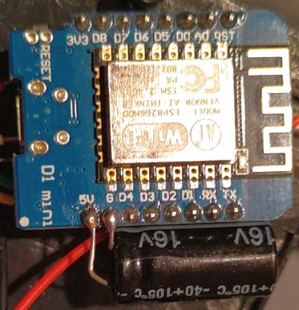
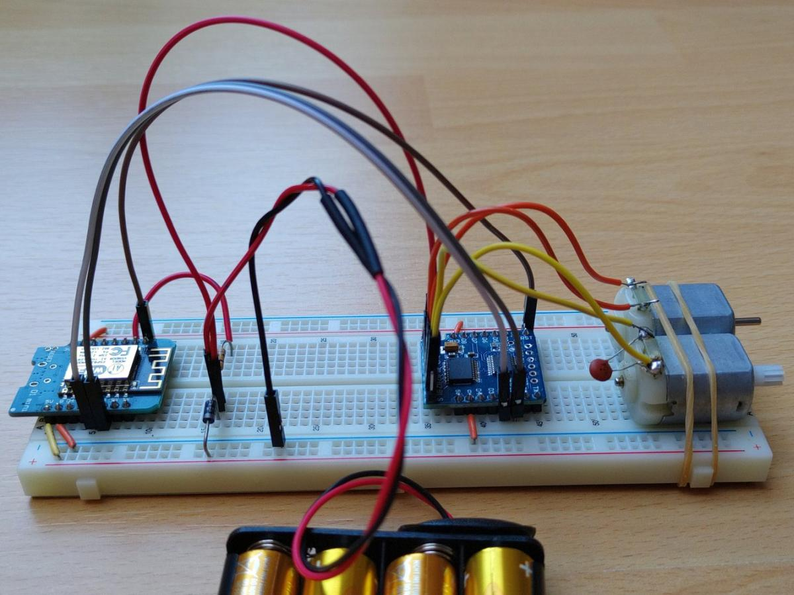

# ESP8266 Remote Control

Remote control for model cars based on the _ESP8266_, especially the _Wemos D1 mini_. With a mobile phone you can connect to the car via WLAN and control it with the web browser.

Features:
* Recycling old RC cars with broken remote controls
* Provides its own WLAN
* Multi touch control from any device with a web browser
* Telemetry channel (e.g. battery level)

# Parts list

A minimum number of components is required.

Quantity | Description
---------|-----------
1        | WeMos D1 Mini 
1        | WeMos D1 Mini Motor Shield V1
1        | Electrolyte capacitor 2200 µF/16 V
1        | Resistor 470 kOhm 5%
1        | Diode 1N4001 
1        | RC car without electronics and 6V battery supply
1        | Smart phone

**Note:** In this project the WeMos D1 Mini Motor Shield **Version 1** was used. This is no longer in production. Alternatively, any other Motor Shield can be used. The wiring and the source code must then be adapted accordingly.

# Soldering

The Motor Shield must be connected to the Wemos D1 Mini with two pin strips. 

The resistor and the diode are soldered on the back of the motor shield. The diode reduces the battery voltage from 6V to about 5.3V, which is within the tolerance range of the Wemos D1 Mini. The resistor forms a voltage divider with the internal resistors of the Wemos D1 Mini at the analog input. The analog input measures the battery voltage.

On the backside of the motor shield there are two pads which have to be connected with solder: RST and I2C (STBY).

Since the ESP8266 and the motors are supplied from the same batteries, the voltage can drop temporarily when the motors are under heavy load. With a buffer capacitor and the diode, the power supply of the ESP8266 is much more robust.

# Car Wiring

The wiring with the RC Car is shown in the following photo. The main drive for forward and reverse is connected to the motor output B from the Motor Shield. In this case it is the yellow and the green cable. The motor for steering is connected to motor output A. In this case it is the blue and the white cable. The last thing to connect is the power supply. In this case it is the black and the red cable. 

# Programming

The firmware is built with [PlatformIO](https://platformio.org/) and also loaded into the ESP8266 with it. The source code for the firmware can be found in the `firmware` directory. For building and uploading open the PlatformIO CLI in the `firmware` directory and execute the command `pio run -t upload`. The file system with the web application is transferred with the command `pio run -t uploadfs`.

Note: The port for the serial interface to be used must be set in advance with the environment variable `PLATFORMIO_PORT`. However, the port can also be configured in the `platformio.ini` file.

Alternatively, of course, this can be done via Visual Studio Code using the PlatformIO extension.

For the development of the web application, a simple web server is located in the `demo-server` directory. The file `layout.css` is generated with a small program in the directory `generate-layout-css`. These tools can be compiled with the programming language [Go](https://go.dev/) if required.

# Usage

Follow these steps to launch the web application on your smart phone:
* Search for the WLAN with the name `RC Device 1` using the smart phone.
* Connect to the WLAN with the password `rcdevice1`. Even if there is no Internet connection, a connection should be forced.
* Open in a web browser one of the following URLs:
  * `rcdevice1`
  * `http://rcdevice1`
  * `http://192.168.84.1`
* The web application should now load in the web browser.

# Diagnostics

The built-in LED on the Wemos D1 Mini communicates the current status of the vehicle via a blink code:

No. of flashes | Meaning
---------------|---------------
1 | No connection to the web application on the smart phone.
2 | Battery voltage dropped below threshold (default 4.0V). The vehicle is locked in this state.
3 | The flash file system has an error.
4 | WIFI can't be initialized.
5 | DNS server can't be started.
Continuously on | Command from the web application (F/B/L/R) is executed.

The state is also regularly output on the USB serial interface.

# Prototype 

Some more pictures of the prototype follow, so that the wiring can be traced better. The buffer capacitor was not yet planned here.

## Authors

Copyright (c) 2022 [Mathias Dz.](https://github.com/mdzio)

## Licence

This project is licensed under the [GNU General Public License V3](LICENSE.txt).
